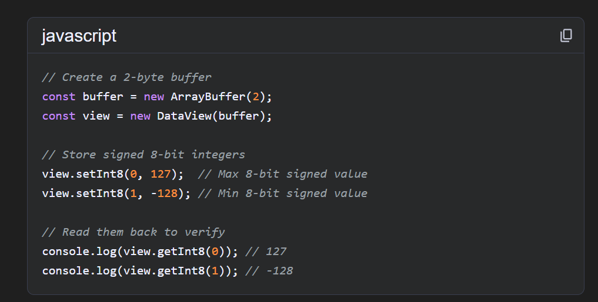
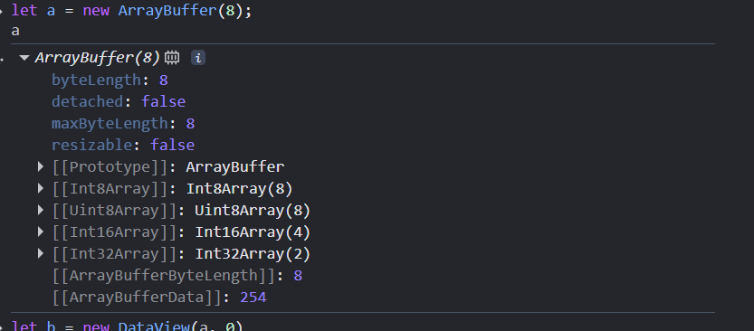
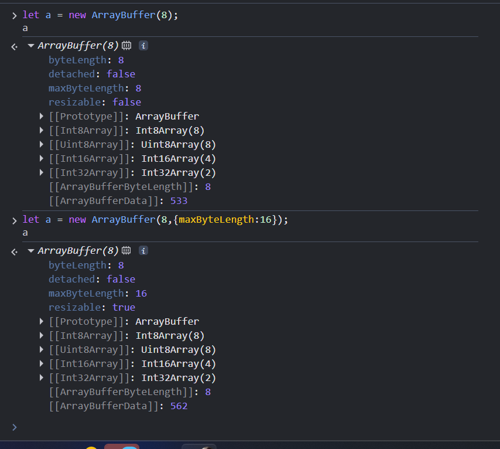
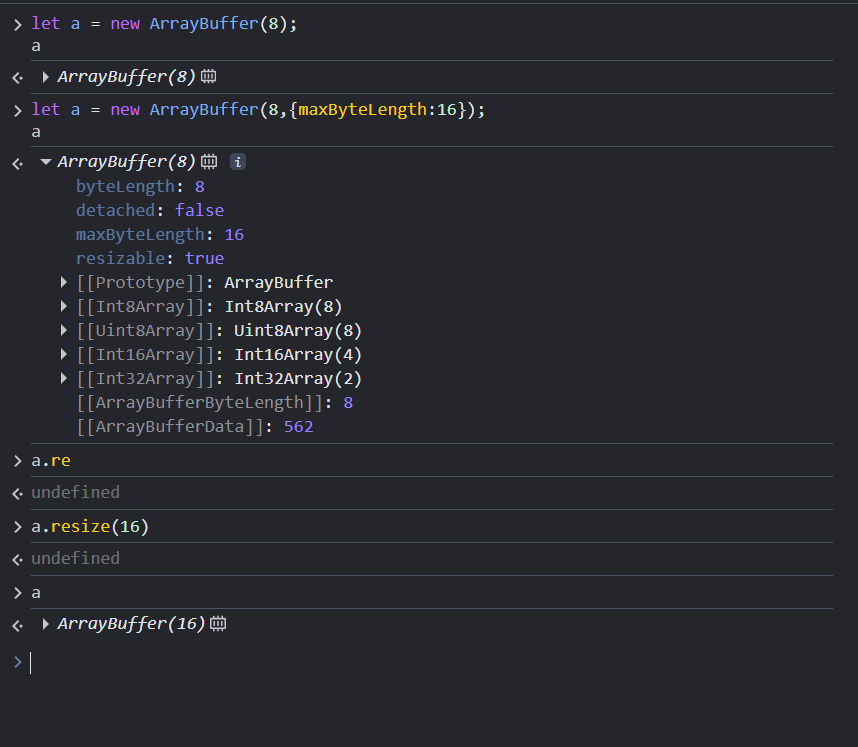
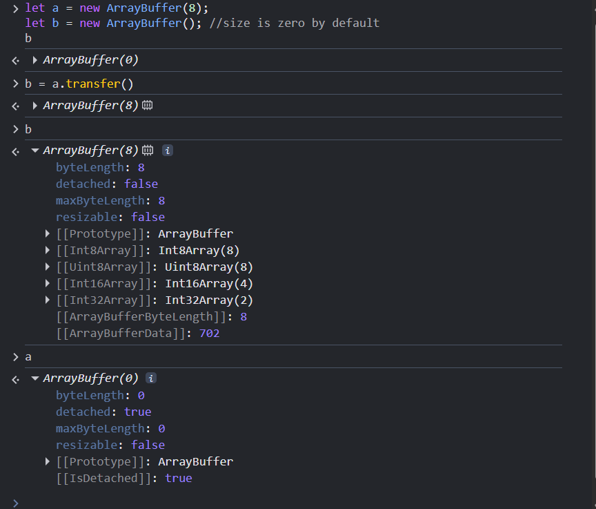
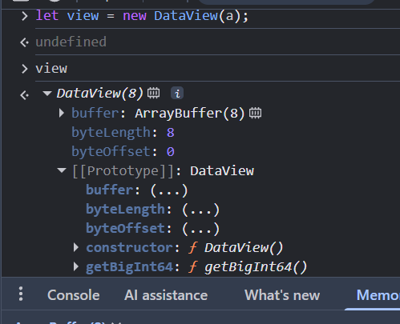
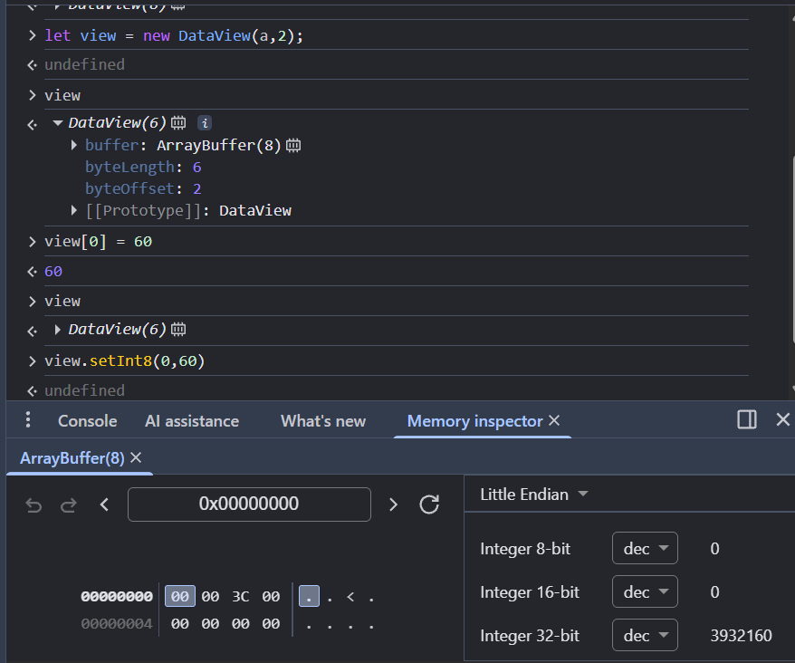
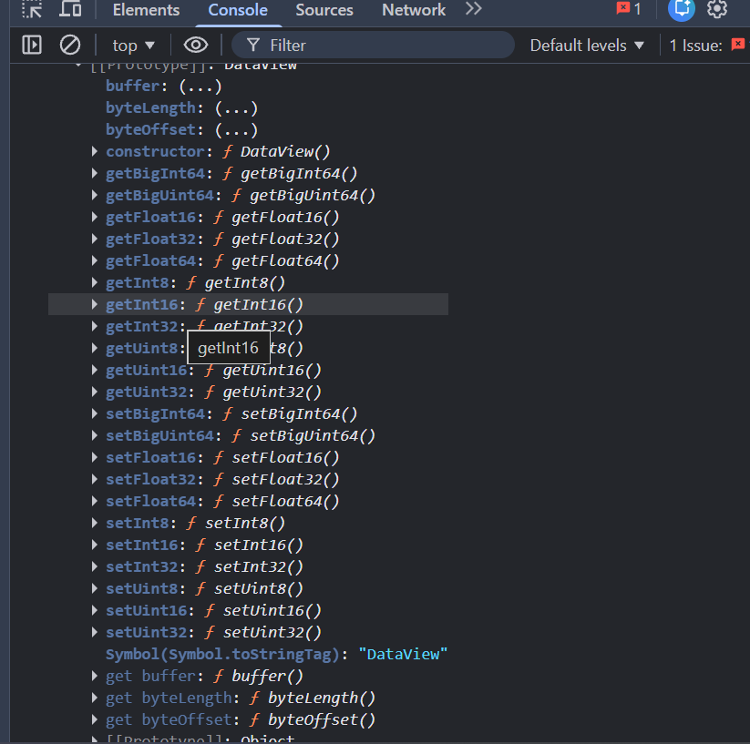
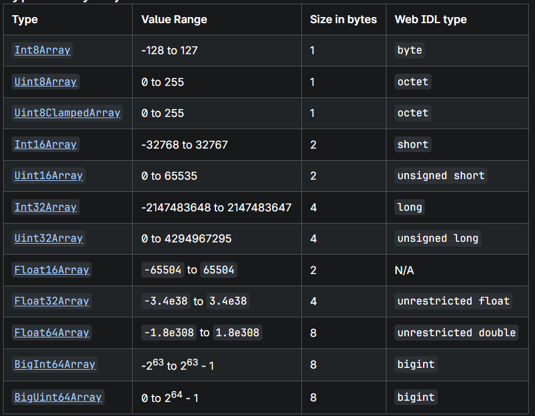

### ArrayBuffer

1. create arraybuffer using new keywords
ex:- let a = new ArrayBuffer(8); --> agar tum isme kuch nhi pass kroge to by default y 0 byte lega

2. 8 means you pass your size of the buffer
3. there is two types of the value you can see
        1. signed :- nigative value, that we can store inside Arraybuffer -128 to 127
        2. unsigned :- positive value, that we can store inside Arraybuffer 0 to 255
4. To update the array Buffer we can use `DataView` and `TypedArray`.
5. we can't directly update ArrayBuffer.
6. that's why we are using `DataView` and `TypedArray`.
7. node.js internally used TypedArray. because DataView doesn't provide all the functionality.
8. When you create ArrayBuffer you can see some property.

-->let's i explain you line by line 
1. `resizable and maxByteLength` 
    
    - you can see previously resizable is false because maxByteLength is fixed
    - but once i increased that length of maxByteLength suddenly resizable value become true
    - now i can increate my byte length If needed.


2. `detached` --> .transfer()
help of this property we can transfer our memory to another Arraybuffer.
but the twist is that we can't use detached property to transfer we only use transer().which is you can see in the image now `detached` value become true for previous arraybuffer not for assigned .



QNA:-  can we transfer our empty memory or full memory size if no then how can transfer our empty memory to another ArrayBuffer.


### DataView
DataView ek object hai jo ArrayBuffer ke andar stored raw binary data ko read/write karne ke liye use hota hai — with full control on data type and format.

later we discuss some importent property that helps to write in arraybuffer. but currently we discuss that we can decide from where our index start to write.

For Example:-
1. i can start our Index some specific position, How can we do this let's i show you below with example.
--> let a = new ArrayBuffer();
    let view = new let view = new DataView(a); // either you can pass directly buffer size or speratly.
onece you enter `view` you can see some property

which is avillable inside image -->
        1. byteLenth:- which is showing you length of ArrayBuffer.
        2. byteOffset:- that helps to decide from where you can start your Index.

let view = new DataView(a, 2) --> it meand you want your index start from 2.

Now when you add byte on 0th Index but your data store at 2nd index because you set byteOffset at 2nd Index.



there is some property that helps to write and read in ArrayBuffer.




### TypedArray:- 
```
To understand TypedArray first you know that TypedArray is not any function and constructor that you use directly.
        you can use some method and define property If you know the actual size. remeber one thing you can't say that TypedArray better than dataview becuase both are different thing. and DataView provids too much control of the ArrayBuffer..


```
- There is TypedArray that helps to control on ArrayBuffer
